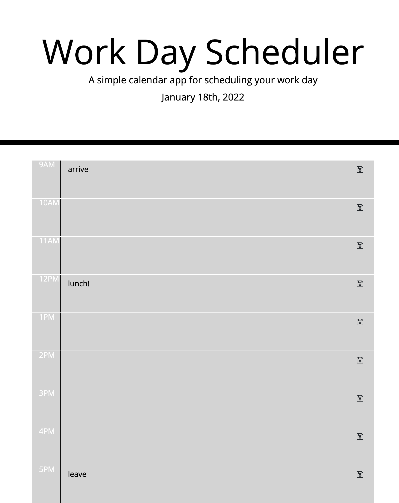

# hw5-workday-scheduler

## Description

A daily planner for laying out activities for the current day. Displays a row for each standard working hour (9Am - 5PM), with an area for the user to input an action item. When user inputs and item, it is saved locally to be continually displayed on repeat visit to the page. The timeblocks are color coded to show whether they are past hours, the present hour, or future hours.

## Screenshot

## Links to Application

-   Here is the repo: [RedComet6/hw5](https://github.com/RedComet6/hw4-code-quiz)
-   Here is the pages: [RedComet6 hw5 Pages](https://redcomet6.github.io/hw4-code-quiz/)
